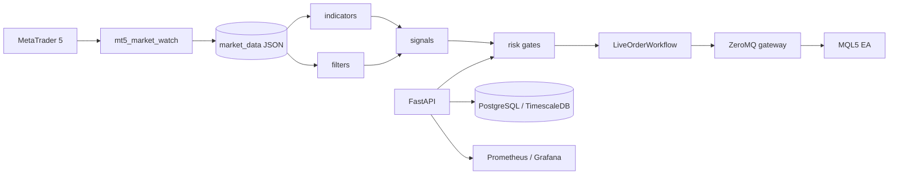

# Smart MT5 Trading System

سیستم محلی و سرویس‌محور برای دریافت داده از MetaTrader 5، ذخیره و پردازش
کندل‌ها، محاسبه اندیکاتورها، ارزیابی فیلترها و اجرای کنترل‌شده سفارش‌ها.
Backend با Python/FastAPI، پایگاه‌داده PostgreSQL/TimescaleDB و gateway مبتنی بر
ZeroMQ ساخته شده است. داشبورد Streamlit و پایش Prometheus/Grafana به‌صورت
اختیاری در Docker Compose اجرا می‌شوند.

> **هشدار ایمنی:** این پروژه نرم‌افزار معاملاتی است. حالت پیش‌فرض dry-run و
> auto-trading خاموش است. تا وقتی شواهد مستقل برای EA، broker، reconciliation و
> circuit breaker ثبت نشده، هیچ سفارش واقعی یا Demo را فعال نکنید.

## وضعیت فعلی

- مسیر سفارش زنده باید فقط از `LiveOrderWorkflow` عبور کند.
- `POST /api/v1/signals/{signal_id}/execute` به‌صورت پیش‌فرض `dry_run=true` دارد.
- محدودیت نماد، حجم، زیان روزانه، magic number، freshness، idempotency و تأیید
	قبل از مسیر زنده بررسی می‌شوند.
- timeout یا نتیجه نامشخص broker به‌صورت خودکار retry نمی‌شود و باید reconcile شود.
- اعتبارسنجی محلی و تست‌ها آماده‌اند، اما مجوز نهایی live trading صادر نشده است.

جزئیات معماری در [docs/ARCHITECTURE.md](docs/ARCHITECTURE.md)، قرارداد API در
[docs/API_CONTRACT.md](docs/API_CONTRACT.md) و قواعد داده در
[docs/DATA_CONTRACT.md](docs/DATA_CONTRACT.md) قرار دارد.

## معماری



اجزای اصلی:

| بخش | محل | مسئولیت |
|---|---|---|
| API | `src/python/api/` | health، readiness، OHLC، execution و reconciliation |
| داده و database | `src/python/data/`، `migrations/` | تنظیمات داده، SQLAlchemy و Alembic |
| execution | `src/python/execution/` | workflow سفارش، policy، gateway و reconciliation |
| ریسک | `src/python/risk/` | RR، زیان روزانه، circuit breaker و خبر |
| ML و backtest | `src/python/ml/`، `src/python/backtest/` | آموزش، artifact مدل و ارزیابی تاریخی |
| اندیکاتورها | `indicators/` | RSI، ATR، ADX، MACD، Bollinger، MA و موارد دیگر |
| فیلترها | `filters/` | trend، FVG، SMC، structure، confirmation و volatility |
| اتصال MT5 | `mt5_account/` | login، market watch، account history و ابزارهای compatibility |
| داشبورد | `src/python/dashboard/` | رابط عملیاتی اختیاری با Streamlit |
| عملیات | `ops/`، `scripts/` | Docker، پایش، migration، backup و readiness |

## پیش‌نیازها

- Windows برای اتصال واقعی به ترمینال MetaTrader 5
- Python 3.12
- Docker Desktop و Docker Compose برای اجرای سرویس‌ها
- ترمینال MT5 باز و حساب Demo فقط برای تست‌های کنترل‌شده
- Git در checkout فعلی قابل‌تأیید نیست؛ اطلاعات remote و branch را از محیط
	توسعه خود بررسی کنید.

## راه‌اندازی محلی Python

در PowerShell از ریشه پروژه:

```powershell
py -3.12 -m venv .venv
.venv\Scripts\Activate.ps1
py -3.12 -m pip install --upgrade pip
py -3.12 -m pip install -r requirements\lock\full.txt
Copy-Item .env.example .env
```

مقادیر secret در `.env` را تغییر دهید. فایل `.env` نباید commit شود. برای اجرای
محلی بدون PostgreSQL، API در محیط non-production می‌تواند از SQLite استفاده کند؛
برای production، `DATABASE_URL` و PostgreSQL/TimescaleDB الزامی است.

## اجرای سرویس‌ها با Docker Compose

حداقل سرویس‌های API و پایگاه‌داده:

```powershell
docker compose up -d timescaledb api
```

پایش Prometheus، Alertmanager و Grafana:

```powershell
docker compose up -d timescaledb api prometheus alertmanager grafana
```

داشبورد Streamlit:

```powershell
docker compose --profile dashboard up -d
```

آموزش مدل با profile مربوطه:

```powershell
docker compose --profile training run --rm ml-training
```

نشانی‌های محلی پیش‌فرض:

| سرویس | نشانی |
|---|---|
| API | `http://localhost:8000` |
| OpenAPI | `http://localhost:8000/docs` |
| Dashboard | `http://localhost:8501` |
| Prometheus | `http://localhost:9090` |
| Grafana | `http://localhost:3000` |

برای توقف سرویس‌ها:

```powershell
docker compose down
```

Compose برای `POSTGRES_PASSWORD`، `API_AUTH_TOKEN` و
`GRAFANA_ADMIN_PASSWORD` مقدار صریح می‌خواهد. از passwordهای نمونه در محیط
واقعی استفاده نکنید.

## اجرای API بدون Docker

```powershell
.venv\Scripts\Activate.ps1
$env:PYTHONPATH = "."
py -3.12 -m uvicorn src.python.api.app:app --host 127.0.0.1 --port 8000
```

در حالت production، startup ابتدا migration و schema verification را انجام
می‌دهد. endpoint `/health` فقط زنده بودن process را نشان می‌دهد؛ برای وضعیت
dependencyها از `/ready` استفاده کنید.

## API فعال

| متد | مسیر | کاربرد |
|---|---|---|
| `GET` | `/health` | سلامت process و نسخه schema/model |
| `GET` | `/ready` | آمادگی dependencyها، مخصوصاً database |
| `GET` | `/metrics` | metrics داخلی Prometheus |
| `GET` | `/api/v1/data/ohlc` | خواندن OHLC با `symbol` و `timeframe` |
| `POST` | `/api/v1/signals/{signal_id}/execute` | اجرای dry-run یا مسیر live کنترل‌شده |
| `GET` | `/api/v1/orders/unknown` | مشاهده سفارش‌های با نتیجه نامشخص |
| `POST` | `/api/v1/orders/{order_id}/reconcile` | ثبت نتیجه broker توسط operator |
| `POST` | `/api/v1/orders/reconcile/automatic` | reconciliation کنترل‌شده |

routeهای حفاظت‌شده به token و role مناسب نیاز دارند. داشتن دسترسی read-only
هرگز مجوز اجرای سفارش نیست. قرارداد کامل payload، خطا، idempotency و نقش‌ها در
[docs/API_CONTRACT.md](docs/API_CONTRACT.md) آمده است.

## تست و کنترل کیفیت

اجرای تست‌های پروژه:

```powershell
py -3.12 -m pytest -q --import-mode=importlib
```

اجرای یک مجموعه تست:

```powershell
py -3.12 -m pytest tests\python\risk\test_calculator.py -q
```

کامپایل قبل از CI:

```powershell
py -3.12 -m compileall -q src tests
```

بررسی فرمت و lint با Ruff:

```powershell
py -3.12 -m ruff check src tests indicators filters mt5_account
py -3.12 -m ruff format --check src tests indicators filters mt5_account
```

workflow اعتبارسنجی در [.github/workflows/python-validation.yml](.github/workflows/python-validation.yml)
قرار دارد. اجباری بودن این workflow به تنظیمات branch protection وابسته است و
از checkout محلی قابل‌تأیید نیست.

## replay امن MT5

برای Strategy Tester بدون live trading از guardrailهای زیر استفاده کنید:

```powershell
py -3.12 scripts\verify_strategy_tester_inputs.py `
	src\mql5\SmartTraderEA.mq5 `
	ops\mt5\SmartTraderEA.demo.set
```

این مسیر باید `InpAllowLiveTrading=false` و `InpEnableZmq=false` داشته باشد و
تعداد trade/deal آن صفر بماند. اجرای live به ترمینال، symbol، magic number،
credential، تأیید دستی و evidence عملیاتی جداگانه نیاز دارد.

## متغیرهای مهم محیطی

نمونه کامل در [.env.example](.env.example) است. مهم‌ترین تنظیمات:

| متغیر | نقش | مقدار امن پیش‌فرض |
|---|---|---|
| `DATABASE_URL` | اتصال database | در production الزامی |
| `API_AUTH_TOKEN` | token سازگاری API | خالی و fail-closed |
| `API_AUTH_JWT_SECRET` | secret توکن کوتاه‌عمر | خالی و fail-closed |
| `MT5_ENABLED` | اتصال runtime به MT5 | `false` |
| `MT5_AUTO_TRADING_ENABLED` | اجازه auto trading | `false` |
| `MT5_DEMO_ENABLED` | فعال‌سازی demo محدود | `false` |
| `MT5_LIVE_SYMBOLS` | whitelist نمادها | `XAUUSD_l` در نمونه |
| `MT5_MAX_POSITION_VOLUME` | سقف حجم پوزیشن | `0.02` در نمونه |
| `MT5_MAX_DAILY_LOSS` | سقف زیان روزانه | `10` در نمونه |
| `ZMQ_EXECUTION_ENDPOINT` | endpoint ارتباط با EA | `tcp://127.0.0.1:5555` |
| `SHADOW_LEDGER_PATH` | ledger حالت shadow | `data/shadow_orders.jsonl` |

اسکریپت `scripts/start_local_demo.ps1` برای حساب Demo محلی، گیت
`MT5_AUTO_TRADING_ENABLED=true` را فعال می‌کند؛ این override فقط در مسیر Demo
است و تأیید دستی، whitelist نماد، سقف حجم، سقف زیان روزانه و circuit breaker
همچنان الزامی هستند. مقدار امن پیش‌فرض در `.env.example` برای سایر مسیرها
همچنان `false` باقی می‌ماند.

## نکات توسعه

- اندیکاتورها و فیلترها باید pure و بدون side effect معاملاتی باقی بمانند.
- هیچ کدی نباید مستقیماً `order_send` را صدا بزند؛ مرز مجاز
	`LiveOrderWorkflow` است.
- تغییر ساختار داده را در [docs/DATA_CONTRACT.md](docs/DATA_CONTRACT.md)، تغییر
	API را در [docs/API_CONTRACT.md](docs/API_CONTRACT.md) و تغییر معماری را در
	[docs/ARCHITECTURE.md](docs/ARCHITECTURE.md) ثبت کنید.
- secret، credential، token و password را در source، log یا response ذخیره
	نکنید.
- artifactهای مدل در `models/`، داده در `market_data/` یا `data/`، log در
	`logs/` و گزارش در `reports/` قرار می‌گیرد؛ فایل موقت در root نسازید.

## مستندات مرتبط

- [معماری](docs/ARCHITECTURE.md)
- [قرارداد API](docs/API_CONTRACT.md)
- [قرارداد داده](docs/DATA_CONTRACT.md)
- [راهنمای اندیکاتورها](indicators/README.md)
- [راهنمای تست‌ها](tests/README.md)
- [راهنمای فیلترها](filters/README.md)
- [تغییرات پروژه](CHANGELOG.md)
