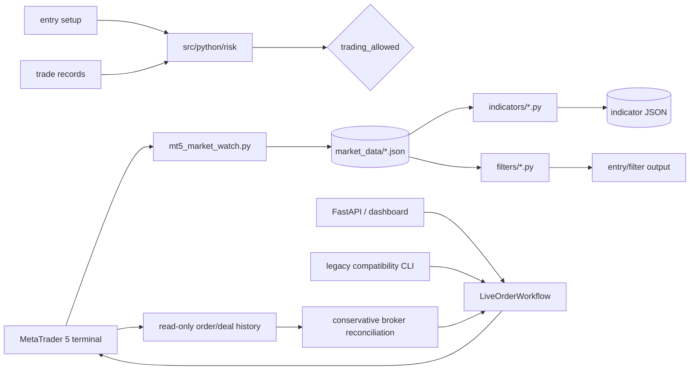
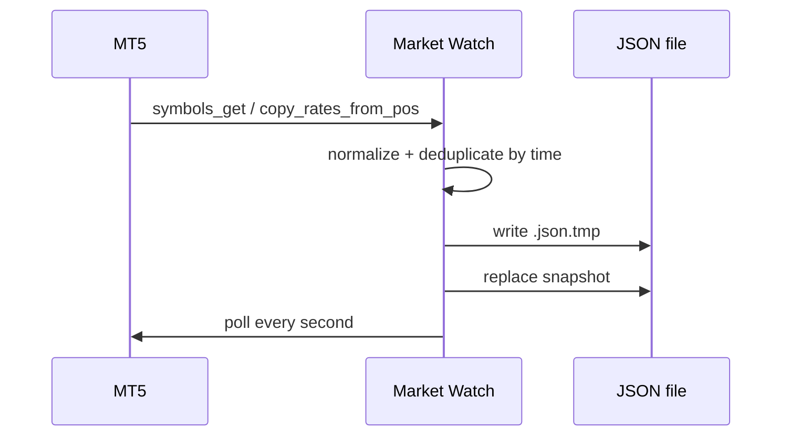
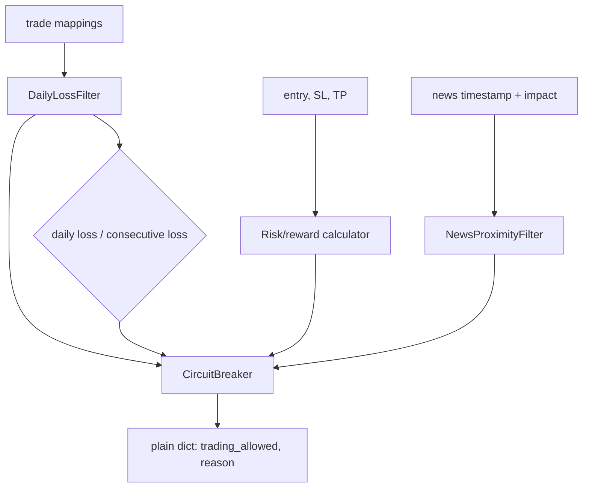
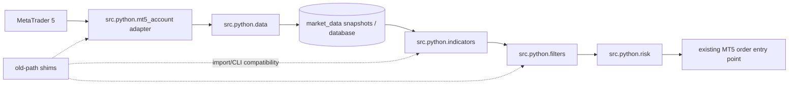

# گزارش معماری و ساختار پروژه Smart MT5 Trading System

> Migration دیتابیس با Alembic در [alembic.ini](../alembic.ini) و
> [migrations/](../migrations/) مدیریت می‌شود. نسخهٔ schema و model پس از
> initialization در جدول `system_versions` ثبت می‌شود؛ برای PostgreSQL، image
> API پیش از Uvicorn، [migrate_db.py](../scripts/migrate_db.py) را اجرا می‌کند.

> **دامنه و روش بررسی:** این گزارش بر اساس checkout محلی موجود در تاریخ 2026-09-16 تهیه شده است. پوشهٔ فعلی Git repository نیست؛ بنابراین remote، branch و commit قابل‌تأیید نیستند. ادعاهای «پیاده‌سازی‌شده» فقط به فایل‌های موجود استناد می‌کنند و مواردی که صرفاً در دستورالعمل‌ها آمده‌اند با برچسب **[برنامه‌ریزی‌شده]** مشخص شده‌اند.

## 1. خلاصهٔ اجرایی

### حاکمیت ML و مهاجرت تدریجی

مسیر canonical مدل در [src/python/ml/](../src/python/ml/) بر پایهٔ artifactهای
versioned است. هر artifact می‌تواند `dataset_version`،
`feature_schema_hash`، `model_checksum` و گزارش `walk_forward_validation` را
ثبت کند؛ [ModelRegistry](../src/python/ml/registry.py) این متادیتا را همراه با
checksum فایل artifact به‌صورت atomic نگه می‌دارد. fixture رسمی برای regression
در [tests/fixtures/](../tests/fixtures/) قرار دارد و قبل از استفاده با SHA-256
اعتبارسنجی می‌شود.

مصرف‌کننده‌های dashboard و execution اکنون فقط از
`MLInferenceService` و artifactهای ثبت‌شده استفاده می‌کنند. training pipeline
نیز مدل‌ها را با `save_artifact` تولید می‌کند و ensemble رسمی آن
`ProbabilityEnsemble` است. پس از انتقال کامل مصرف‌کننده‌ها، wrapperهای
compatibility قدیمی حذف شدند و packageٔ `ml.models` فقط factory اختیاری
LightGBM را نگه می‌دارد.

### وضعیت پیاده‌سازی فعلی

مرز HTTP در [src/python/api/app.py](../src/python/api/app.py) شامل health،
خواندن OHLC و اجرای signal با dry-run پیش‌فرض است. ارتباط اجرای سفارش با EA در
[src/python/api/zmq_gateway.py](../src/python/api/zmq_gateway.py) با REQ/REP،
timeout و fail-closed reconnect پیاده‌سازی شده است. سرویس API از
[Dockerfile.api](../ops/docker/Dockerfile.api) و compose service `api` قابل اجراست.

احراز هویت routeهای حساس اکنون role-based و در production fail-closed است:
OHLC نقش `read_only`، فهرست سفارش‌های نامشخص نقش `order_review`، اجرای live
نقش `signal_execution` و reconciliation نقش `emergency_stop` می‌خواهد.
`LiveOrderWorkflow` وضعیت durable کنترل execution را از repository می‌خواند و
پیش از هر سفارش live refresh می‌کند؛ نبودن یا unreadable بودن state، stop
اضطراری، expiry، محدودیت demo، زیان روزانه و تعارض version مانع تعامل broker
می‌شوند. این کنترل‌ها در restart حفظ می‌شوند.

Gateway خطاهای timeout، transport، protocol و unexpected را جدا می‌کند و برای
هیچ‌کدام retry سفارش انجام نمی‌دهد. فقط خطای transport socket را reset می‌کند؛
timeout نتیجه را unknown نگه می‌دارد و برای reconciliation واگذار می‌کند.
در production lifespan از Alembic و schema verifier استفاده می‌کند و
`Base.metadata.create_all` فقط در helper صریح test/local باقی مانده است.

### Stage E: Demo Shadow Mode

مسیر `src/python/execution/shadow.py` یک ledger append-only برای ثبت
would-be orderها فراهم می‌کند. `TradingExecution` در حالت `shadow` فقط با
قیمت live ورودی به cycle پر می‌شود، نتیجه را در ledger ثبت می‌کند و هرگز به
MT5 متصل نمی‌شود. `AutoTrader` همان position manager موجود را برای ارزیابی
SL/TP با قیمت‌های cycleهای بعدی استفاده می‌کند؛ خروج سپس به ledger با قیمت
واقعی مشاهده‌شده متصل می‌شود.

این پروژه یک سیستم محلی/سرویسی پایتونی برای دریافت دادهٔ بازار از ترمینال
MetaTrader 5، ذخیرهٔ داده، محاسبهٔ اندیکاتورها، فیلتر سیگنال، ارزیابی ریسک و
اجرای کنترل‌شدهٔ سفارش است. مسیرهای مستقل `indicators/` و `filters/` هنوز
عمدتاً CLIهای فایل‌محور هستند؛ `mt5_account/` به ترمینال باز MT5 متصل می‌شود؛
و `src/python/risk/` منطق pure و قابل‌آزمون ریسک را ارائه می‌کند. مرز FastAPI،
لایهٔ SQLAlchemy/TimescaleDB، gateway مبتنی بر ZeroMQ، workflow اجرای زنده،
ML/backtest و EAهای MQL5 نیز در checkout حاضر هستند؛ اجرای واقعی سفارش همچنان
به تأیید demo-only و تنظیمات صریح وابسته است.

## 2. هویت checkout و سطح اطمینان

| مورد | نتیجه |
|---|---|
| مسیر checkout | `D:\Nojom mali\robat metatreder5\AI smart tred\AI Smart Tred App` |
| Git remote / branch / HEAD | **[UNVERIFIED]**؛ اجرای دستورات Git با خطای «not a git repository» مواجه شد |
| README ریشه | وجود ندارد |
| Python اجرایی | `py --version` = Python 3.12.4 |
| مجوز | **[UNVERIFIED]**؛ فایل LICENSE یافت نشد |
| آزمون اجراشده | `py -3 -m pytest -q` → **419 passed, 2 skipped** |

## 3. تشخیص فناوری از کد واقعی

| لایه | فناوری واقعی | شواهد |
|---|---|---|
| زبان | Python با type hints و `from __future__ import annotations` | [indicators/common.py](../indicators/common.py#L1-L17)، [risk/calculator.py](../src/python/risk/calculator.py#L1-L9) |
| اتصال معاملاتی | بستهٔ `MetaTrader5` و API ترمینال ویندوز | [mt5_login.py](../mt5_account/mt5_login.py#L1-L11)، [mt5_trade_orders.py](../mt5_account/mt5_trade_orders.py#L154-L172) |
| دادهٔ محلی | JSON فایل‌محور، با آرایهٔ `candles` و خروجی‌های اندیکاتور | [common.py](../indicators/common.py#L10-L17)، [mt5_market_watch.py](../mt5_account/mt5_market_watch.py#L63-L112) |
| منطق اندیکاتور | RSI، ATR، ADX، MACD، Bollinger، Stochastic، MA، Volume، Ichimoku و Market Regime | فهرست و قرارداد اجرا در [indicators/README.md](../indicators/README.md#L5-L24) |
| منطق فیلتر | روند، FVG، SMC، ساختار بازار، FOMO، تأیید، بین‌بازاری و نوسان/زمان | [filters/](../filters/)، نمونهٔ زنجیرهٔ روند در [trend_filters.py](../filters/trend_filters.py#L30-L201) |
| ریسک | نسبت ریسک/بازده، زیان روزانه/زیان‌های متوالی، circuit breaker، نزدیکی خبر | [calculator.py](../src/python/risk/calculator.py#L29-L88)، [manager.py](../src/python/risk/manager.py#L95-L206)، [news_proximity.py](../src/python/risk/news_proximity.py#L83-L163) |
| آزمون | pytest برای risk و unittest برای filters؛ هر دو توسط pytest جمع‌آوری می‌شوند | [tests/README.md](../tests/README.md#L7-L11)، [test_calculator.py](../tests/python/risk/test_calculator.py#L1-L14) |
| فناوری‌های پیاده‌سازی‌شده/هدف | FastAPI، SQLAlchemy، PostgreSQL/TimescaleDB، pyzmq، MQL5، scikit-learn/XGBoost/PyTorch | [requirements/full.in](../requirements/full.in)، [src/python/api/app.py](../src/python/api/app.py)، [docker-compose.yml](../docker-compose.yml) |

## 4. ورودی‌ها و entry pointها

### 4.1 دریافت داده و اتصال MT5

- [mt5_login.py](../mt5_account/mt5_login.py#L130-L171) ترمینال را پیدا می‌کند، login می‌کند، وضعیت اینترنت/ترمینال را در thread جدا پایش می‌کند و در پایان `mt5.shutdown()` را اجرا می‌کند.
- [mt5_market_watch.py](../mt5_account/mt5_market_watch.py#L161-L214) نمادهای visible را هر ثانیه بررسی و برای timeframeهای M1 تا MN1 دادهٔ کندل را در `market_data/` ذخیره می‌کند.
- [mt5_account_info.py](../mt5_account/mt5_account_info.py#L107-L169) حساب، positionها و orderهای فعال را چاپ می‌کند.
- [mt5_account_history.py](../mt5_account/mt5_account_history.py) تاریخچهٔ معاملات را از MT5 می‌گیرد (اجرای مستقل).

### 4.2 سفارش‌دهی

- مرز canonical ارسال زنده، `LiveOrderWorkflow` در
  [live_order_workflow.py](../src/python/execution/live_order_workflow.py) است.
  این workflow gateهای whitelist نماد، magic، حجم، daily loss، spread،
  confirmation، `order_check` و audit را قبل از `order_send` اعمال می‌کند.
- `mt5_trade_orders.py` و `mt5_manage_orders.py` فقط compatibility CLI هستند.
  مسیر live آن‌ها fail-closed است و مستقیماً به MT5 سفارش نمی‌فرستد؛ مصرف‌کننده‌ها
  باید به `LiveOrderWorkflow` منتقل شوند.
- تست معماری [test_order_submission_architecture.py](../tests/python/execution/test_order_submission_architecture.py)
  تضمین می‌کند تنها فایل مجاز برای فراخوانی مستقیم `order_send`، workflow مرکزی
  باشد.

### 4.3 پردازش آفلاین

هر فایل اندیکاتور/فیلتر معمولاً تابع `calculate_*`، تابع ذخیرهٔ JSON و `if __name__ == "__main__"` دارد. قرارداد نمونهٔ اندیکاتورها در [indicators/README.md](../indicators/README.md#L17-L24) مستند شده است.

## 5. موجودی دستورات و راستی‌آزمایی

| کار | دستور تأییدشده | وضعیت |
|---|---|---|
| اجرای همهٔ تست‌ها | `py -m pytest -q --import-mode=importlib` | فرمان CI از [requirements/lock/full.txt](../requirements/lock/full.txt) نصب می‌کند؛ نتیجه باید در هر checkout جداگانه تأیید شود |
| اجرای تست‌های مستندشده | `py -m unittest discover -s tests -p "test_*.py" -v` | در [tests/README.md](../tests/README.md#L7-L11) مستند شده؛ در این بررسی اجرا نشد |
| اجرای یک تست | `py -m pytest tests/python/risk/test_calculator.py -q` | **[INFERRED]** از runner موجود؛ در مستندات رسمی پروژه نیامده |
| اجرای یک اندیکاتور | `python indicators\rsi.py market_data\GBPUSD_l_H1_20260904_07.json` | در [indicators/README.md](../indicators/README.md#L17-L23) آمده؛ نام فایل نمونه در checkout موجود نیست |
| نصب dependency | `py -3.12 -m pip install -r requirements/lock/mt5.txt` | وابستگی Windows-only در [requirements/mt5.in](../requirements/mt5.in) تعریف شده است |
| lint / format | Ruff format/check روی فایل‌های Python تغییرکرده در CI | required بودن check در branch protection هنوز **[UNVERIFIED]** است |
| typecheck | هیچ دستور/پیکربندی یافت نشد | **[UNVERIFIED]** |
| compile | `py -m compileall -q src tests` | اجرا شد |
| Compose validation | `docker compose config` با `API_AUTH_TOKEN` و `POSTGRES_PASSWORD` محیطی | اجرا شد |
| API serve | `uvicorn src.python.api.app:app --host 0.0.0.0 --port 8000` | در [Dockerfile.api](../ops/docker/Dockerfile.api) تأیید شده؛ E2E در این محیط اجرا نشد |
| CI workflow | GitHub Actions workflow در `.github/workflows/python-validation.yml` | تعریف شد؛ required-check enforcement **[UNVERIFIED]** و نیازمند تنظیم دستی پلتفرم است |

## 6. ساختار دایرکتوری

| مسیر | نقش فعلی |
|---|---|
| `filters/` | 9 ماژول فیلتر و `entries.json` نمونه |
| `indicators/` | 10 ماژول اندیکاتور به‌علاوهٔ helper مشترک `common.py` |
| `mt5_account/` | 6 اسکریپت اتصال، market watch، اطلاعات حساب، history، مدیریت و ارسال سفارش |
| `src/python/risk/` | بستهٔ ریسک با 5 فایل |
| `market_data/` | 52 snapshot JSON از نمادهای TRXUSD، XRPUSD، UKBRENT و XAUUSD در timeframeهای مختلف و خروجی اندیکاتورها |
| `tests/filters/` | 9 مجموعه تست unittest |
| `tests/python/risk/` | 4 مجموعه تست pytest |
| `.github/agents/` و `.vscode/prompts/` | نقش‌ها و دستورهای تیمی؛ specification هستند، نه implementation |
| `.pytest_cache/`, `__pycache__/`, `.playwright-mcp/` | artifactهای محلی/ابزار؛ بخشی از محصول runtime نیستند |

## 7. جریان دادهٔ فعلی



**نکتهٔ معماری:** در کد واقعی هیچ مسیر اتصال مستقیمی از indicator/filter به order executor دیده نمی‌شود؛ `filters/entries.json` فقط یک نمونهٔ سادهٔ سیگنال است و قرارداد typed یا schema ندارد ([entries.json](../filters/entries.json#L1-L5)).

## 8. معماری هدفِ اعلام‌شده اما هنوز پیاده‌نشده

اسناد agentها معماری بزرگ‌تری را پیشنهاد می‌کنند: collector در `src/python/data/`، ML، backtest، trading signal/risk، FastAPI، PostgreSQL/TimescaleDB، ZeroMQ و EA در `src/mql5/`. این موارد در [01_architect.md](../.github/agents/01_architect.md#L14-L34)، [02_data_collector.md](../.github/agents/02_data_collector.md#L16-L30) و [07_order_executor.md](../.github/agents/07_order_executor.md#L16-L24) فهرست شده‌اند. در checkout فعلی، منطق تولید سیگنال در [src/python/trading_signal/](../src/python/trading_signal/) قرار دارد و باید به‌عنوان component فعال در نظر گرفته شود.

## 9. زیرسیستم‌های مهم

### 9.1 لایهٔ دریافت و snapshot داده

`mt5_market_watch.py` نمادهای visible را از MT5 می‌گیرد، برای هر timeframe `copy_rates_from_pos` را صدا می‌زند، رکوردها را به مقدار JSON-serializable تبدیل می‌کند، بر اساس `time` deduplicate می‌کند و خروجی را ابتدا در فایل موقت می‌نویسد و سپس replace می‌کند ([mt5_market_watch.py](../mt5_account/mt5_market_watch.py#L52-L112)). این کار atomic-write نسبی دارد، ولی storage هنوز فایل محلی است و هم‌زمانی/قفل‌گذاری ندارد.



### 9.2 لایهٔ اندیکاتور و فیلتر

`indicators/common.py` قرارداد پایهٔ خواندن `candles`, استخراج OHLC/V، rolling mean و true range را فراهم می‌کند ([common.py](../indicators/common.py#L10-L67)). هر اندیکاتور خروجی را به candleها enrich می‌کند یا payload مستقلی می‌سازد. فیلترها مشابه‌اند و به‌صورت standalone محاسبه و ذخیره می‌شوند؛ تست trend نمونهٔ warm-up، روند صعودی، threshold و overwrite خروجی را بررسی می‌کند ([test_trend_filters.py](../tests/filters/test_trend_filters.py#L20-L54)).

ریسک این بخش: schema مرکزی برای candle/indicator وجود ندارد؛ برخی helperها با `KeyError` یا تبدیل مستقیم `float` خطا می‌دهند و versioning خروجی مشخص نشده است.

### 9.3 زیرسیستم ریسک

این تنها بخش نسبتاً لایه‌ای پروژه است. `calculator.py` pure است و RR را برای BUY/SELL اعتبارسنجی می‌کند؛ `manager.py` معاملات را به روزهای تقویمی گروه‌بندی، بر اساس timestamp مرتب و با دو معیار زیان روزانه و تعداد زیان متوالی متوقف می‌کند ([manager.py](../src/python/risk/manager.py#L95-L181)). `CircuitBreaker` facade وضعیت آخرین ارزیابی و override دستی را نگه می‌دارد ([circuit_breaker.py](../src/python/risk/circuit_breaker.py#L7-L40)). `news_proximity.py` فاصلهٔ خبر، impact و سود مثبت را بررسی و در حالت risk-free سفارش‌های باز را به break-even علامت‌گذاری می‌کند ([news_proximity.py](../src/python/risk/news_proximity.py#L113-L135)).



## 10. Cross-cutting concerns

| concern | وضعیت واقعی |
|---|---|
| اعتبارسنجی ورودی | در risk و workflow مرکزی صریح؛ نمونه در [calculator.py](../src/python/risk/calculator.py#L12-L48) و [live_order_workflow.py](../src/python/execution/live_order_workflow.py) |
| خطا | عمدتاً `ValueError`/`RuntimeError` و چاپ فارسی؛ logging استاندارد وجود ندارد |
| احراز هویت/مجوز | role-based برای routeهای حساس؛ login فعلی MT5 در اسکریپت محلی است |
| اسرار | login در [mt5_login.py](../src/python/mt5_account/mt5_login.py#L104-L140) credential را از environment می‌خواند؛ secret scan، rotation، redaction و staging injection هنوز به‌صورت عملیاتی اثبات نشده‌اند و P0.4 باز است |
| symbol whitelist | در دستورالعمل الزامی است، اما در `send_*_order` whitelist دیده نمی‌شود؛ فقط existence/visibility نماد بررسی می‌شود |
| محدودیت حجم | workflow مرکزی محدودیت حجم نماد و حداکثر حجم پوزیشن را اعمال می‌کند |
| circuit breaker سفارش | سفارش live فقط از workflow مرکزی عبور می‌کند؛ مسیرهای legacy قبل از هر ارسال fail-closed هستند |
| observability | `print` و `mt5.last_error()`؛ metrics/tracing/structured logs وجود ندارد |
| config | environment فقط برای مسیر ترمینال استفاده شده؛ `.env` loader یا settings مرکزی وجود ندارد |
| transaction/database | repository SQLAlchemy با transaction صریح و کنترل durable execution |

## 11. شکاف‌ها و ریسک‌های اولویت‌دار

### داشبورد تصمیم‌گیری فعلی

| رتبه | کد | وضعیت | گیت لازم برای عبور |
|---:|---|---|---|
| 1 | P0.1 | مسدودِ پس از preflight | read-only، readiness و dry-run محدود سبز؛ نماد واقعی `XAUUSD_l` است، اما EA/ZeroMQ، پذیرش broker، reconciliation و evidence circuit breaker runtime هنوز باقی است؛ اجرای سفارش مجاز نیست |
| 2 | P0.2 | نیمه‌کامل | اثبات runtime مسیر واحد سفارش و نبود bypass |
| 3 | P0.3 | تکمیل‌شده در محیط توسعه | دو connection مستقل PostgreSQL سبز؛ staging مستقل برای release باز است |
| 4 | P0.4 | نیمه‌کامل | credential ناقص fail-closed و redaction تست شده؛ secret scan، rotation و staging injection باز است |
| 5 | P1.5 | نیمه‌کامل | local staging backup/restore و schema verification سبز؛ managed staging، WAL/RPO و rollback هنوز باز |
| 6 | P1.1 | تکمیل‌شده محلی | Ruff check و format check روی `src/` و `tests/` سبز |
| 7 | P1.2 | تکمیل‌شده محلی | `mypy --follow-imports=skip src/python` روی ۸۲ فایل بدون خطا |
| 7 | P1.3 | تکمیل‌شده محلی | Python 3.12، lock کامل و clean validation سبز؛ MT5-host tests جدا هستند |
| 8 | P1.4 | تأییدناپذیر محلی | required CI توسط مالک repository |
| 9 | P2 | deferred | فقط پس از بسته‌شدن P0 و گیت‌های اصلی P1 |

تا رتبه‌های 1 تا 4 بسته نشده‌اند، feature معاملاتی جدید در scope نیست و فقط
hardening، تست و evidence مجاز است.

1. **P0 تکمیل‌شده:** احراز هویت و جداسازی نقش routeهای حساس، شامل `order_review` و
   fail-closed بودن credentialهای production.
2. **P0 تکمیل‌شده:** دوام وضعیت execution، refresh پیش از سفارش، توقف اضطراری،
   محدودیت demo، version check و رد fail-closed در نبود یا خرابی database.
3. **P0 تکمیل‌شده:** طبقه‌بندی خطاهای ZeroMQ و ممنوعیت retry خودکار برای timeout،
   transport، protocol و unexpected.
4. **P0 تکمیل‌شده:** اجرای migration و schema verification در startup production؛
   `create_all` فقط برای test/local.
5. **P1 تکمیل‌شده در محیط توسعه:** اجرای runtime روی PostgreSQL 15/TimescaleDB،
   migration، verifier و lifecycle پایهٔ هر سه hypertable بررسی شده است؛
   deployment مستقل production-like و recovery همچنان باز است.
6. **P1 تکمیل‌شده برای baseline:** Strategy Tester با profileهای
   `InpAllowLiveTrading=false` و `InpEnableZmq=false` و نماد broker
   `XAUUSD_l` با artifact ثبت‌شده، `Test passed`، `Total Trades=0` و
   `Total Deals=0` اجرا شده است. Demo E2E با EA واقعی، broker response و
   reconciliation همچنان باز است.
7. **P0 تکمیل‌شده در محیط توسعه:** تست race محلی و دو تست integration PostgreSQL
   با دو connection مستقل سبز شدند؛ اجرای staging مستقل و Demo E2E واقعی هنوز
   باز هستند. تا بسته‌شدن همهٔ gateهای فعال live مجاز نیست.
8. **P1 تکمیل‌شده محلی:** Ruff، Mypy، compile و non-MT5 pytest در یک محیط
   disposable با Python 3.12 و `requirements/lock/full.txt` سبز هستند؛
   dependencyهای observability و TestClient نیز در lock کامل ثبت شدند.
9. **P1 باز:** staging recovery و backup/restore باید در
   PostgreSQL/TimescaleDB مستقل اجرا و اندازه‌گیری شوند.
10. **بالا:** lockfileهای محیطی در `requirements/lock/` نگهداری می‌شوند؛ پس از هر
   تغییر در ورودی‌های `requirements/*.in` باید lock مربوطه بازتولید و بازبینی شود.
11. **متوسط:** ساختار package دوگانه است (`indicators/`, `filters/`, `mt5_account/`
   در ریشه در کنار `src/python/risk/`) و importها در تست‌ها با `sys.path.insert`
   اصلاح می‌شوند.

## 12. تصمیم‌های معماری قابل استنباط

### ADR-1: پردازش محلی و فایل‌محور در مرحلهٔ فعلی

- **تصمیم:** دادهٔ MT5 فعلاً در JSON snapshot ذخیره و توسط CLIهای مستقل پردازش می‌شود.
- **شاهد:** [mt5_market_watch.py](../mt5_account/mt5_market_watch.py#L63-L112) و [indicators/README.md](../indicators/README.md#L17-L24).
- **پیامد:** شروع ساده و قابل مشاهده است، اما concurrency، query، schema evolution و deployment چندماشینه محدود می‌شود.

### ADR-2: منطق risk بدون side effect

- **تصمیم:** محاسبهٔ RR، زیان و خبر در توابع pure و plain dictionaries نگه داشته شده است.
- **شاهد:** [calculator.py](../src/python/risk/calculator.py#L29-L88)، [news_proximity.py](../src/python/risk/news_proximity.py#L83-L135).
- **پیامد:** تست‌پذیری خوب است؛ برای production باید adapter صریحی آن را به execution gate وصل کند.

### ADR-3: معماری هدف service-oriented

- **تصمیم اعلام‌شده، نه اجراشده:** FastAPI/DB/ZeroMQ/EA و agentهای تخصصی.
- **شاهد:** [01_architect.md](../.github/agents/01_architect.md#L7-L34).
- **پیامد:** قبل از توسعه باید contractهای داده و مرز packageها تثبیت شوند؛ در حال حاضر این ADR فقط specification است.

## 13. راهنمای افزودن قابلیت

1. اگر قابلیت محاسباتی است، تابع pure با type hints و validation در package مربوط اضافه کنید و تست boundary بنویسید.
2. اگر ورودی/خروجی JSON تغییر می‌کند، schema و نمونهٔ سازگار را هم‌زمان مستند کنید؛ فعلاً سند DATA_CONTRACT موجود نیست.
3. برای هر قابلیت MT5، رفتار disconnect، `last_error()` و shutdown را مشخص کنید؛ order path را بدون تأیید ایمنی تغییر ندهید.
4. تست را در `tests/filters/` یا `tests/python/risk/` مطابق package فعلی قرار دهید؛ از `sys.path.insert` جدید تا حد امکان پرهیز و package layout را یکپارچه کنید.
5. قبل از استفادهٔ واقعی، فقط روی demo account و با circuit breaker مستقل
   اعتبارسنجی کنید؛ baseline Strategy Tester موجود است، اما proof کامل Demo
   E2E و order/reconciliation واقعی هنوز وجود ندارد.

## 14. Confidence assessment

| حوزه | سطح اطمینان | توضیح |
|---|---|---|
| فایل‌ها و تعداد تقریبی ماژول‌های موجود | High | از listing محلی |
| رفتار risk و indicatorهای بررسی‌شده | High | کد و تست مستقیم خوانده/اجرا شد |
| رفتار runtime اتصال MT5 | Inferred | کد خوانده شد، اتصال واقعی MT5 در این محیط اجرا نشد |
| فناوری‌های FastAPI/DB/ZeroMQ/ML/MQL5 | High برای مرزهای پیاده‌سازی‌شده؛ runtime واقعی MT5/DB **[UNVERIFIED]** | کد، تست‌های محلی و contractها موجودند؛ gateهای واقعی اجرا نشده‌اند |
| وضعیت CI و branch protection | Inferred/Unverified | workflow محلی وجود دارد؛ required-check enforcement باید دستی تأیید شود |
| سازگاری production و ایمنی مالی | Unverified/پرریسک | baseline Strategy Tester بدون معامله اجرا شده، اما order path با EA واقعی، broker و reconciliation E2E هنوز تأیید نشده است |

## 15. footnotes و فایل‌های مرجع

- [tests/README.md](../tests/README.md): دستور مستندشدهٔ unittest.
- [indicators/README.md](../indicators/README.md): فهرست اندیکاتورها و قرارداد CLI.
- [mt5_market_watch.py](../mt5_account/mt5_market_watch.py): دریافت و ذخیرهٔ snapshotهای بازار.
- [mt5_trade_orders.py](../mt5_account/mt5_trade_orders.py): مسیر واقعی ارسال market/limit order.
- [risk/calculator.py](../src/python/risk/calculator.py): RR و فیلتر setup.
- [risk/manager.py](../src/python/risk/manager.py): daily loss و consecutive loss.
- [risk/circuit_breaker.py](../src/python/risk/circuit_breaker.py): facade توقف اضطراری.
- [risk/news_proximity.py](../src/python/risk/news_proximity.py): کنترل نزدیکی خبر.
- [.github/instructions/copilot.instructions.md](../.github/instructions/copilot.instructions.md): policy و معماری هدف اعلام‌شده.

## 16. طرح سازمان‌دهی بدون تغییر رفتار

> جابه‌جایی با shimهای سازگاری انجام شده است؛ منطق runtime اکنون در packageهای
> canonical زیر `src/python/` قرار دارد و مسیرهای قدیمی برای حفظ import و CLI
> باقی مانده‌اند.

### ساختار مقصد

```text
src/
  python/
    indicators/       # منطق indicators و helperهای مشترک
    filters/          # منطق filterها و زنجیرهٔ ارزیابی
    mt5_account/      # adapterها و CLIهای اتصال/سفارش MT5
    data/             # ingestion، مدل‌ها و storage موجود
    risk/             # منطق risk موجود
tests/
  indicators/
  filters/
  mt5_account/
  data/
  risk/
market_data/          # دادهٔ موجود؛ جابه‌جا یا بازنویسی نشود
mt5_account/account_history/  # تاریخچهٔ موجود؛ جابه‌جا یا بازنویسی نشود
```

`src/python/data` و `src/python/risk` همین حالا مسیر canonical بودند. سه packageٔ
ریشه‌ای نیز منتقل شده‌اند و فایل‌های قدیمی اکنون shim هستند:

| مسیر قدیمی | shim مجاز | مقصد canonical | نکته |
|---|---|---|---|
| `indicators.*` | re-export با همان نام | `src.python.indicators.*` | importهای قدیمی حفظ شوند |
| `filters.*` | re-export با همان نام | `src.python.filters.*` | `entries.json` در ریشه دست‌نخورده بماند |
| `mt5_account.*` | re-export با همان نام | `src.python.mt5_account.*` | اتصال MT5 و credential تغییر نکند |
| `data.*`, `risk.*` | shim فقط در صورت حذف/تغییر مسیر import | `src.python.data`, `src.python.risk` | importهای فعلی تست‌ها حفظ شوند |

Shim نباید منطق جدید، side effect اضافه، یا تغییر در defaultها داشته باشد؛ فقط
نام قدیمی را به implementation canonical وصل می‌کند. حذف shim فقط پس از یک
release/دورهٔ سازگاری و green بودن کل suite مجاز است.

### بررسی import و entry point پیش از جابه‌جایی

اسکن checkout نشان داد:

1. تست‌های `filters` با `sys.path` مستقیماً از `filters/` import می‌کنند.
2. تست‌های `data` و `risk` با `sys.path` از `src/python/` و packageهای
   `data`/`risk` import می‌کنند.
3. importهای داخلی packageهای منتقل‌شده به importهای package-qualified تغییر
   کرده‌اند تا اجرای تست و import از `src/python` مستقل و پایدار باشد.
4. داده‌های `market_data/` و `mt5_account/account_history/` عمداً جابه‌جا
   نشده‌اند.

### جریان مقصد



در مرحلهٔ اول همچنان JSONهای موجود منبع historical هستند. ایجاد database،
ZeroMQ، FastAPI، ML یا backtest بخشی از این سازمان‌دهی نیست و نباید ضمن
جابه‌جایی به‌صورت ضمنی اضافه شود.

### ترتیب امن اجرا

1. ثبت فهرست importها و entry pointهای بالا و baseline تست.
2. ایجاد packageهای مقصد و `__init__.py` بدون تغییر implementation.
3. انتقال هر domain در یک commit مستقل؛ سپس افزودن shim قدیمی.
4. انتقال تست‌ها فقط پس از green شدن همان domain؛ مسیرهای قدیمی تست برای
   compatibility تا پایان migration قابل‌قبول‌اند.
5. اجرای `py -m pytest -q` و smoke اجرای هر CLI با `--help` (برای CLIهای
   دارای side effect فقط import/parse، نه login یا order).
6. فقط پس از verification، به‌روزرسانی مستندات و حذف artifactهای generated از
   فهرست source. `market_data/` و `account_history/` به هیچ وجه شامل این
   cleanup نیستند.

### ممنوعیت‌های migration

- تغییر در فرمول indicator/filter/risk، ترتیب ارزیابی، defaultها، payload JSON،
  نام فایل‌های market data یا رفتار سفارش‌دهی.
- انتقال، rename، reformat یا regenerate فایل‌های `market_data/` و
  `mt5_account/account_history/`.
- افزودن `__pycache__`, `.pytest_cache` یا `.playwright-mcp` به `src/`.
- قرار دادن credential در shim، documentation example یا source control.
